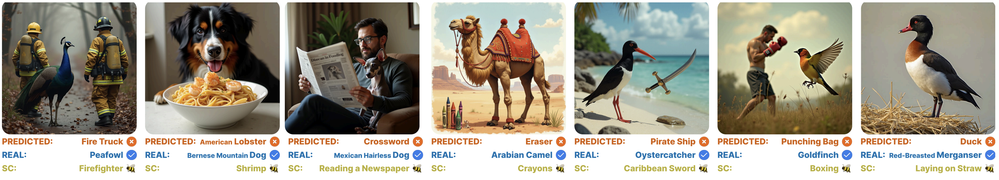
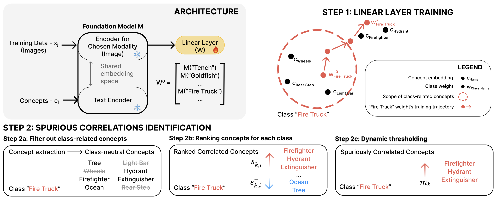
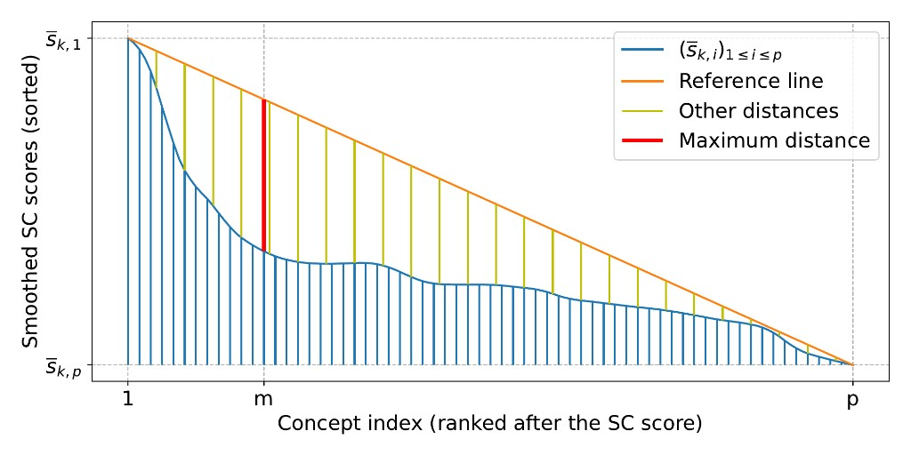

# BEE Aware of Spuriousness: mechanistic interpretability for fine tuning foundation models

Fine tuning is usually framed as “adaptation”. In practice, it can also manufacture shortcuts.

A model can recognize the “right” object or phrase and still bet on the wrong cue because that cue was cheaper and more reliable inside the training distribution. The scary part is how quietly this happens: if the shortcut exists in both train and validation splits, metrics can look great right up until deployment.

In our ICLR 2026 paper “Bridging Explainability and Embeddings: BEE Aware of Spuriousness”, we introduce **BEE**, a diagnostic tool that surfaces spurious correlations by analyzing **weight space drift** and **embedding geometry** rather than relying only on held out validation data.

Paper: https://openreview.net/forum?id=9jYpHmI8ot  
PDF: https://openreview.net/pdf?id=9jYpHmI8ot  
Code: https://github.com/bit-ml/bee  

---

## TL;DR

- Spurious correlations are non causal cues that become powerful shortcuts after fine tuning.
- Validation accuracy can miss them when counterexamples are absent.
- BEE detects shortcuts **mechanistically**, by reading what training changes inside representation space: classifier weight drift and concept alignment.
- Output: an actionable per class shortlist of suspicious concepts you can stress test, audit, and mitigate.

---

## Visual intuition: what “shortcut learning” looks like

Below are qualitative flips from ImageNet. The real class is clearly present, but adding an object tied to a spurious concept can flip the prediction to a different class which is not visually depicted in the image.

*Figure 1. Qualitative examples where spurious concepts override the primary signal.*

---

## Why this is mechanistic interpretability (not just post hoc explainability)

Many explainability methods ask: “why did the model predict X on this input” and then attach an attribution map.

BEE sits closer to **mechanistic interpretability** because it tries to name the driver of behavior by inspecting structure and geometry inside the learned solution:

- how class weights move in embedding space during training
- which concept directions become unusually aligned with each class after fine tuning

That shift in focus is why BEE can surface shortcuts even when they do not appear as obvious failures on a standard validation split.

---

## The BEE pipeline (high level)

*Figure 2. BEE overview and where the “mechanistic” signal comes from: class weight drift and concept alignment.*

At a high level, BEE does two things:

1) Train a **linear probe** on frozen embeddings, with class weights initialized from class name embeddings.  
2) Rank **class neutral concepts** that become uniquely aligned with each class weight after training.

---

## How BEE works (practical steps)

**1) Linear probing as a diagnostic lens**
BEE trains a linear layer on top of frozen embeddings and anchors each class weight to the embedding of the class name. This makes subsequent drift interpretable.

**2) Concept extraction and filtering**
BEE constructs a candidate pool of concepts and filters out those that are obviously class defining, keeping concepts that should not define the label.

**3) Relative alignment scoring**
A concept is suspicious when it is not just similar to a class, but uniquely similar to that class compared to alternatives.

**4) Dynamic thresholding**
Instead of picking an arbitrary top k, BEE selects the cutoff at the “knee” of the score curve.

*Figure 3. Dynamic thresholding picks the “knee” of the score curve rather than a fixed top‑k.*

---

## A slightly more theoretical view: why weight drift exposes shortcuts

BEE is built on a geometric claim:

When you train a linear classifier on top of a fixed embedding space, the learned class weight vector becomes a summary of “what evidence counts” for that class under your training distribution.

For a linear probe, the logit for class \(k\) is:

\[
\ell_k(x) = w_k^\top z(x) + b_k
\]

where \(z(x)\) is the frozen embedding and \(w_k\) is the learned class weight.

### Semantic anchor, then drift
BEE initializes each class with a semantic anchor \(w_k^{(0)}\), the embedding of the class name. After training, you get \(w_k^{(*)}\). The drift:

\[
\Delta w_k = w_k^{(*)} - w_k^{(0)}
\]

captures what optimization rewarded.

If a dataset contains a shortcut, ERM has an incentive to rotate \(w_k\) toward an easier but correlated feature, even if that feature is not part of the class definition. That rotation is a mechanistic signature of shortcut learning.

### Concepts as vectors, spuriousness as relative alignment
Let \(v(c)\) be the embedding of a candidate concept. You can measure similarity, for example with cosine similarity \(s(k,c) = \cos(w_k^{(*)}, v(c))\).

BEE’s key move is making it *relative*:

\[
\text{spur}(k,c) = s(k,c) - \max_{j \neq k} s(j,c)
\]

A concept is suspicious when it is uniquely aligned with one class, especially if it is class neutral.

### Why this can work without counterexamples
Many SC detectors require counterexamples because they learn from observed failures.

BEE instead reads the imprint left by training in the learned geometry. You do not need the shortcut to fail to detect its presence, because the learned weights can already reveal what the model is leaning on.

---

## What this enables in production

Once you have per class spurious concept lists, you can:

1) Stress test intentionally by injecting top concepts and measuring prediction flips  
2) Audit your dataset to find why those concepts correlate with labels  
3) Fix via targeted counterexamples, balancing, or augmentation  
4) Mitigate with spuriousness aware regularization when counterexamples are scarce

---

## References

- OpenReview: https://openreview.net/forum?id=9jYpHmI8ot  
- PDF: https://openreview.net/pdf?id=9jYpHmI8ot  
- Code: https://github.com/bit-ml/bee
