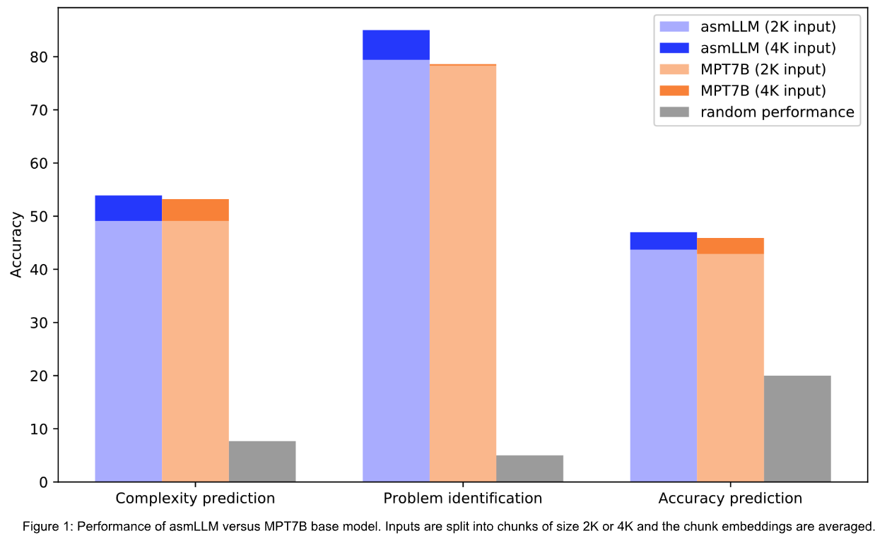
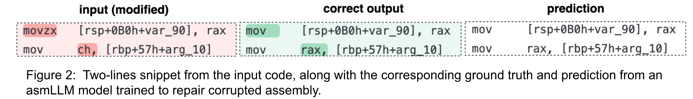

<section class="Post__PostContent-oyq0rs-2 jSdCWo">

Large Language Models (LLMs) took the world by storm in 2023, revolutionizing the way people search and generate text content. LLMs for code have also made inroads in helping people understand code or write code based on requests in natural language. For instance, translating requests to <a href="https://yale-lily.github.io/spider">SQL queries</a> has rapidly advanced since the advent of GPT4.

Most popular code LLMs focus on generating or understanding high-level programming languages such as Python, C++, Java etc. <a href="https://arxiv.org/abs/2308.12950">[1]</a>,<a href="https://arxiv.org/abs/2305.06161">[2]</a>,<a href="https://arxiv.org/abs/2306.08568">[3]</a>,<a href="https://arxiv.org/abs/2308.07124">[4]</a>. However code LLMs tailored to malware analysis should be adapted to better understand assembly code as well. Recent works also explore this avenue <a href="https://arxiv.org/abs/2312.09601">[5]</a>,<a href="https://arxiv.org/abs/2310.16853">[6]</a>,<a href="https://arxiv.org/abs/2311.13721">[7]</a>.

To this end we start from existing general-purpose LLMs such as <a href="https://huggingface.co/mosaicml/mpt-7b">MPT7B</a>, which has been trained on both English text and code. We adapt them to x86-64 assembly data, by finetuning them using the Causal Language Modeling task and the <a href="https://arxiv.org/abs/2106.09685">LoRA</a> method. We then inspect these models to evaluate the quality of their embeddings and their generation capabilities. We call these models <strong>asmLLMs</strong>.

<h2>asmLLMs for feature extraction</h2>

Features learned by pretrained models are crucial for downstream tasks such as anomaly detection, search or classification. Most LLMs (either general purpose or code-based) have little assembly data in their pretraining corpus relative to the entire corpus. Finetuning LLMs on more assembly data should then result in better features. To test this, we developed several downstream classification tasks, where the input is assembly code. Classifiers trained on features from the <strong>asmLLM</strong> should then outperform classifiers trained on features from base LLMs.

To build examples for our tasks, we took C++ solutions from the code contest dataset <a href="https://arxiv.org/pdf/2105.12655v2.pdf">CodeNet 1000</a> and converted them to assembly. The three classification tasks are:

<ul>
<li><em>Complexity prediction</em>, where the input is the assembly corresponding to a C++ function, and the label is the <a href="https://manpages.ubuntu.com/manpages/focal/man1/pmccabe.1.html">cyclomatic complexity</a> of that function (13 classes)</li>
<li><em>Problem identification</em>, where the input is the assembly corresponding to a C++ submission to a code contest, and the label is the ID of the contest problem (20 classes)</li>
<li><em>Accuracy prediction</em>, where the input is the assembly corresponding to a C++ submission to a code contest, and the label is the score achieved by the submission on the benchmark. Instead of predicting the score, the model predicts a class from a set of 5 classes, where each class corresponds to different bins of performance: [0-20) score, [20-40) score, ..., [80-100].</li>
</ul>

The asmLLM in <a href="asm_down">Figure 1</a> is an MPT7B-base finetuned on assembly data using sequences of length 2K. To embed an input, it is first split into chunks of length 2K or 4K tokens. The input embedding is then computed as the average over these chunk embeddings. Results show that classifiers benefit from features from asmLLMs, especially when using larger contexts (4K tokens vs 2K tokens).

<h2>asmLLMs for generative tasks</h2>
<h3>Code repair</h3>

While <strong>asmLLMs</strong> can be used as feature extractors, we are also interested in generative settings such as code-to-code or code-to-text. A typical code-to-code task is code repair, where given a faulty piece of code, the correct version of the code is produced. To test this on assembly, we generate a synthetic dataset where we alter a percentage of the assembly tokens, by modifying instructions (e.g. <strong>mov</strong> -&gt; <strong>lea</strong>), registers (<strong>rax</strong> -&gt; <strong>rsp</strong>) or offsets. We then perform instruction tuning on the asmLLM using (altered assembly, correct assembly) pairs and a 4K token context.

We notice in Figure 2 that the instruction tuned asmLLM model can correctly predict altered instructions (<strong>movzx</strong> -&gt; <strong>mov</strong>) or registers (<strong>ch</strong>-&gt;<strong>rax</strong>).

<h3>Code summarization</h3>

To inspect the code of executable files, malware analysts use a wide array of tools, including powerful decompilers and disassemblers. While top performing LLMs such as GPT-4 are good at explaining high-level languages such as Python or C++, they are less likely to get the big picture of assembly code and instead describe it line by line usually. We are thus interested in the code summarization task, where explaining large chunks of assembly code can help analysts delve into binaries more efficiently.

For this task, we generate a synthetic instruction tuning dataset called OSS-ASM, which consists of (assembly code, explanation) pairs. We first use the OSS-instruct<a href="https://arxiv.org/pdf/2312.02120.pdf">[8]</a> method to produce (C++ code, explanation) pairs by seeding LLMs with assembly snippets from various technical resources. We then convert the C++ code to x86-64 assembly.

<table><thead><tr><th>Model</th><th>Rouge-L</th><th>BLEU</th></tr></thead><tbody><tr><td>GPT-3.5 turbo</td><td>23.22</td><td>2.85</td></tr><tr><td>GPT-4</td><td>26.56</td><td>4.03</td></tr><tr><td><a href="https://huggingface.co/mosaicml/$mpt-7b">MPT7B-base</a> + instruction tuning OSS-ASM</td><td>33.22</td><td>11.89</td></tr><tr><td><a href="https://huggingface.co/mosaicml/mpt-7b-instruct">MPT7B-instruct</a> + instruction tuning OSS-ASM</td><td>33.92</td><td>12.29</td></tr><tr><td><strong>asmLLM</strong> + instruction tuning OSS-ASM</td><td><strong>35.72</strong></td><td><strong>13.65</strong></td></tr></tbody></table>

The <strong>asmLLM</strong> model in the table above is a MPT7B-base, finetuned on a subset of 500M tokens of x86-64 assembly, with LoRA rank r=64 and context length L=4096 tokens. GPT-3.5 and GPT-4 are tested in a zero-shot setup, while the other three models are instruction tuned on the OSS-ASM dataset. Results show that adapting base LLMs on assembly data improves the performance on downstream generative tasks such as code summarization.

Along with results in Figure 1, this highlights the importance of pretraining LLMs on domain-specific data, particularly when dealing with languages that are less represented in large training sets, such as assembly.

<strong>asmLLMs</strong> can become an essential item in a malware analysis toolkit, accelerating the inspection of binaries and improving the threat response time. Future work involves learning across different computer architectures, increasing the diversity of the instruction tuning data and tackling obfuscated code.

<h2>References</h2>
<ol>
<li>Code Llama: Open Foundation Models for Code, <a href="https://arxiv.org/abs/2308.12950">https://arxiv.org/abs/2308.12950</a></li>
<li>StarCoder: may the source be with you!, <a href="https://arxiv.org/abs/2305.06161">https://arxiv.org/abs/2305.06161</a></li>
<li>WizardCoder: Empowering Code Large Language Models with Evol-Instruct, <a href="https://arxiv.org/abs/2306.08568">https://arxiv.org/abs/2306.08568</a></li>
<li>OctoPack: Instruction Tuning Code Large Language Models, <a href="https://arxiv.org/abs/2308.07124">https://arxiv.org/abs/2308.07124</a></li>
<li>Binary Code Summarization: Benchmarking ChatGPT/GPT-4 and Other Large Language Models, <a href="https://arxiv.org/abs/2312.09601">https://arxiv.org/abs/2312.09601</a></li>
<li>CP-BCS: Binary Code Summarization Guided by Control Flow Graph and Pseudo Code, <a href="https://arxiv.org/abs/2310.16853">https://arxiv.org/abs/2310.16853</a>,</li>
<li>Nova+: Generative Language Models for Binaries, <a href="https://arxiv.org/abs/2311.13721">https://arxiv.org/abs/2311.13721</a></li>
<li>Magicoder: Source Code Is All You Need, <a href="https://arxiv.org/abs/2312.02120">https://arxiv.org/abs/2312.02120</a></li>
</ol>
<h2>Credits</h2>

Photo by <a href="https://unsplash.com/@markusspiske?utm_content=creditCopyText&amp;utm_medium=referral&amp;utm_source=unsplash">Markus Spiske</a> on <a href="https://unsplash.com/photos/turned-on-laptop-on-table-uPXs5Vx5bIg?utm_content=creditCopyText&amp;utm_medium=referral&amp;utm_source=unsplash">Unsplash</a>.
</section>

written by <!-- -->Florin Brad, Ioana Pintilie, Marius Dragoi, Dragos Tantaru

