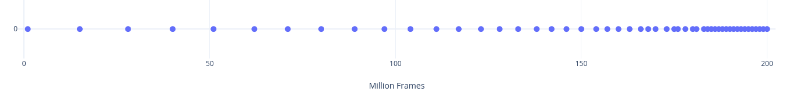
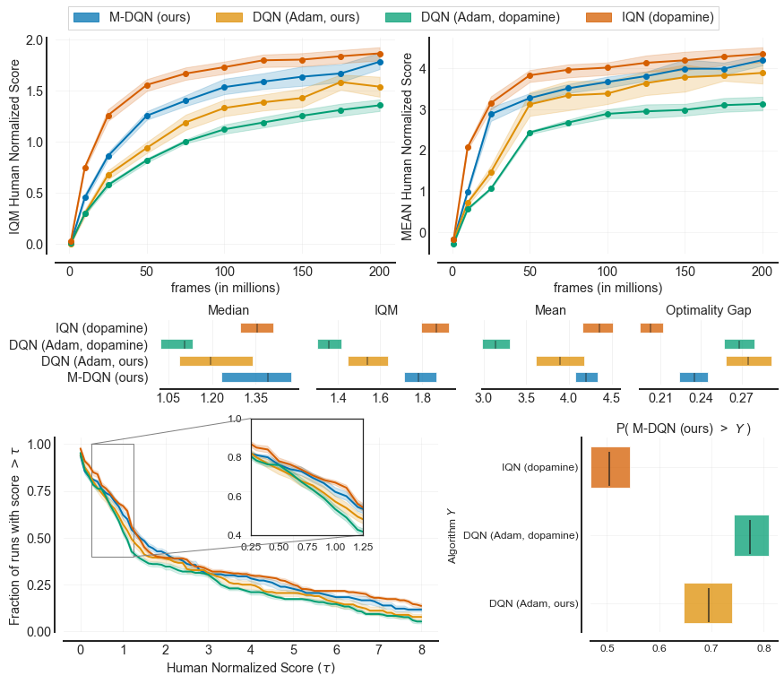

<section class="Post__PostContent-oyq0rs-2 jSdCWo">

Releasing trained models in computer vision and natural language processing has been a major source of progress for the research in these fields and a significant catalyst for the adaption of deep learning models in the industry. By comparison, RL agents pretrained on otherwise resource and time intensive benchmarks such as Arcade Learning Environment are rather hard to come by.

Today, our research group within Bitdefender is making available over 2️⃣5️⃣,0️⃣0️⃣0️⃣ agents trained on 60 games in the Arcade Learning Environment. We hope the diversity and the quality of these trained models will help spur new research in multi-task and imitation learning and contribute to the state of reproducibility in deep reinforcement learning.

The performance of these agents closely matches figures published in the literature and have been used as strong baselines in published and unpublished work. The agents included in this release are Munchausen-DQN and Adam-optimised DQN that compare favourably with more complex agents as well as a C51 agent whose performance matches or exceeds the results reported in the paper that introduced it. We provide three independent training runs for each agent-game combination with the exception of on agent for which we only provide two seeds. We plan to continue releasing new models.

Another feature of this release is the extreme ease of experimenting with the agents. No RL frameworks are required, the dependency list is kept to a minimum, the code is self-contained and takes just two files, making it a breeze to quickly load a checkpoint, visualize the gameplay at high resolution and record it. The simplicity of the code also makes it possible to easily modify the scripts for your own purposes. Converting these models for use in other deep learning frameworks should also be possible.

We encourage you coming with suggestions of how to make this repository of trained models better and more useful. Relevant links:

<ul>
<li>   <a href="https://github.com/floringogianu/atari-agents#trained-atari-agents">floringogianu/atari-agents</a></li>
<li>📂   <a href="https://share.bitdefender.com/s/qCF7jFxkgx2qJeT">download models</a></li>
</ul>
<h2>How we trained the agents</h2>

A major reason for deciding to publish these models is the sheer amount of time required to run DQN-style algorithms on the Atari benchmark. This is especially difficult for small labs.

For this release we used "only" 20 to 40 GPUs (a wide assortment ranging from GTX Titan to newer RTX consumer models) from our cluster at Bitdefender, for a combined running time of about two months for learning all the agents. Considering  a full run on ALE requires 3 seeds <math xmlns="http://www.w3.org/1998/Math/MathML"><semantics><mrow><mo>×</mo></mrow><annotation encoding="application/x-tex">\times</annotation></semantics></math>× 60 games and a single DQN-style agent takes a bit over one week this might seem a bit surprising. What made this possible is that we figured out early that you could launch three to four DQN processes on a single GPU provided the replay buffer is stored in the system RAM. The penalty incurred in terms of wall clock times is easily offset by parallelization in this case.

This is one of the reason our agents have been trained using our own PyTorch implementations and while the code used is not readily available we consider publishing it if there is demand for it.

<h3>A word on training and evaluation protocols</h3>

There are two common training and evaluation protocols encountered in the literature. We named them <code>classic</code> and <code>modern</code> across this project:

<ul>
<li><code>classic</code>: it originates from (Mnih, 2015)<a class="footnote-ref" href="#fn-2">2</a> Nature paper and it mostly appears in DeepMind papers.</li>
<li><code>modern</code>: it originates from (Machado, 2017)<a class="footnote-ref" href="#fn-1">1</a> and a variation of it was adopted by Dopamine<a class="footnote-ref" href="#fn-6">6</a>. Since then it started to show up more often in recent papers.</li>
</ul>

The main two differences between the two are the way stochasticity is induced in the environment and how the loss of a life is treated.

The current crop of agents is summarized below.

<table><thead><tr><th align="left">Algorithm</th><th>Protocol</th><th align="center">Games</th><th align="center">Seeds</th><th align="left">Observations</th></tr></thead><tbody><tr><td align="left"><strong>DQN</strong></td><td><code>modern</code></td><td align="center">60</td><td align="center">3</td><td align="left">DQN agent using the settings from <a href="https://github.com/google/dopamine/blob/master/dopamine/jax/agents/dqn/configs/dqn.gin">dopamine</a>. It's optimised with Adam and uses MSE instead of Huber loss. <strong>A surprisingly strong agent on this protocol</strong>.</td></tr><tr><td align="left"><strong>M-DQN</strong></td><td><code>modern</code></td><td align="center">60</td><td align="center">3</td><td align="left">DQN above but using the <strong>Munchausen trick</strong><a class="footnote-ref" href="#fn-7">7</a>. Even stronger performance.</td></tr><tr><td align="left"><strong>C51</strong></td><td><code>classic</code></td><td align="center">28/57</td><td align="center">3</td><td align="left">Closely follows the original paper<a class="footnote-ref" href="#fn-3">3</a>.</td></tr><tr><td align="left"><strong>DQN Adam</strong></td><td><code>classic</code></td><td align="center">28/57</td><td align="center">2</td><td align="left">A DQN agent trained according to the Rainbow paper<a class="footnote-ref" href="#fn-4">4</a>. The exact settings and plots can be found in our paper<a class="footnote-ref" href="#fn-5">5</a>.</td></tr></tbody></table>

Right off-the bat you can notice that on the <code>classic</code> protocol there are only 28 games out of the usual 57. We trained the two agents on this protocol over one year ago using the now deprecated <code>atari-py</code> project which officially provided the ALE Python bindings in OpenAI's Gym. Unfortunately the package came with a large number of ROMs that are not supported by the current, official, <a href="https://github.com/mgbellemare/Arcade-Learning-Environment">ale-py</a> library. The agents trained on the <code>modern</code> protocol (as well as the code we provide for visualising agents) all use the new <code>ale-py</code>. Therefore we decided against providing support for the older library event if it meant dropping half of the trained models. A great resource for reading about this issue is Jesse's Farebrother <a href="https://brosa.ca/blog/ale-release-v0.7/#rom-management">ALE v0.7 release notes</a>. Importantly, we found out about the issue while checking the performance of the trained models on the new <code>ale-py</code> back-end and we provide plots showing the remaining 28 agents perform as expected (<a href="https://github.com/floringogianu/atari-agents/blob/main/imgs/c51_g28_confirmation.png">C51_classic</a>, <a href="https://github.com/floringogianu/atari-agents/blob/main/imgs/dqn_g28_confirmation.png">DQN_classic</a>).

<h2>How many checkpoints?</h2>

An agent trained on 200M frames usually produces 200 checkpoints times the number of training seeds. In order not to make the download size overly large <strong>we only include 51 checkpoints per training run</strong>. These are sampled geometrically, with denser checkpoints towards the end of the training. This results in the last 20 checkpoints of the full 200 (last 10% of the training run) and then sparser checkpoints towards the beginning of the run, with only 10 out of 51 from the first half. It looks a bit like this:

Note it's not mandatory the best performing checkpoint is included since on some combinations of algorithms and agents the peak performance occurs earlier in training. However this sampling should characterize fairly well the performance of an agent most of the time.

❗✋ If <a href="https://github.com/floringogianu/atari-agents/issues">requested</a>, we can provide the full list of checkpoints for a given agent.

Agents have been trained using PyTorch and the models are stored as compressed <a href="https://pytorch.org/tutorials/recipes/recipes/what_is_state_dict.html">state_dict</a> pickle files. Since the networks used on ALE are fairly simple these could easily be converted for use in other deep learning frameworks.

<h2>Just how well trained are these agents?</h2>

Our PyTorch implementation of DQN trained using Adam on the <code>modern</code> protocol compares favourable to the exact same agent trained using Dopamine. The plots below have been generated using the tools provided by <a href="https://github.com/google-research/rliable">rliable</a>.

A detailed discussion about the performance of DQN + Adam and C51 trained on the <code>classic</code> protocol can be found in our paper<a class="footnote-ref" href="#fn-5">5</a>, where we used these checkpoints as baselines.

<h2>References</h2>

<ol>
<li id="fn-2"><a href="https://www.nature.com/articles/nature14236">Mnih, et al. 2015, _Human-level control through deep reinforcement learning</a><a class="footnote-backref" href="#fnref-2">↩</a></li>
<li id="fn-1"><a href="https://arxiv.org/abs/1709.06009">Machado, et al. 2017, <em>Revisiting the Arcade Learning Environment...</em></a><a class="footnote-backref" href="#fnref-1">↩</a></li>
<li id="fn-6"><a href="http://arxiv.org/abs/1812.06110">Castro, et al. 2018, <em>Dopamine: A Research Framework for Deep RL</em></a><a class="footnote-backref" href="#fnref-6">↩</a></li>
<li id="fn-4"><a href="https://arxiv.org/abs/1710.02298">Hessel, et al. 2017, <em>Combining Improvements in Deep RL</em></a><a class="footnote-backref" href="#fnref-4">↩</a></li>
<li id="fn-5"><a href="https://www.semanticscholar.org/paper/Spectral-Normalisation-for-Deep-Reinforcement-an-Gogianu-Berariu/cf04c05f69022f71b60c7b7252af94f11cad5ef1">Gogianu, et al. 2021, <em>Spectral Normalisation...</em></a><a class="footnote-backref" href="#fnref-5">↩</a></li>
<li id="fn-3"><a href="http://proceedings.mlr.press/v70/bellemare17a.html">Bellemare, et al. 2017, <em>A distributional perspective...</em></a><a class="footnote-backref" href="#fnref-3">↩</a></li>
<li id="fn-7"><a href="https://arxiv.org/abs/2007.14430">Vieillard, et al. 2020, <em>Munchausen Reinforcement Learning</em></a><a class="footnote-backref" href="#fnref-7">↩</a></li>
</ol>

</section>

written by <!-- -->Florin Gogianu

